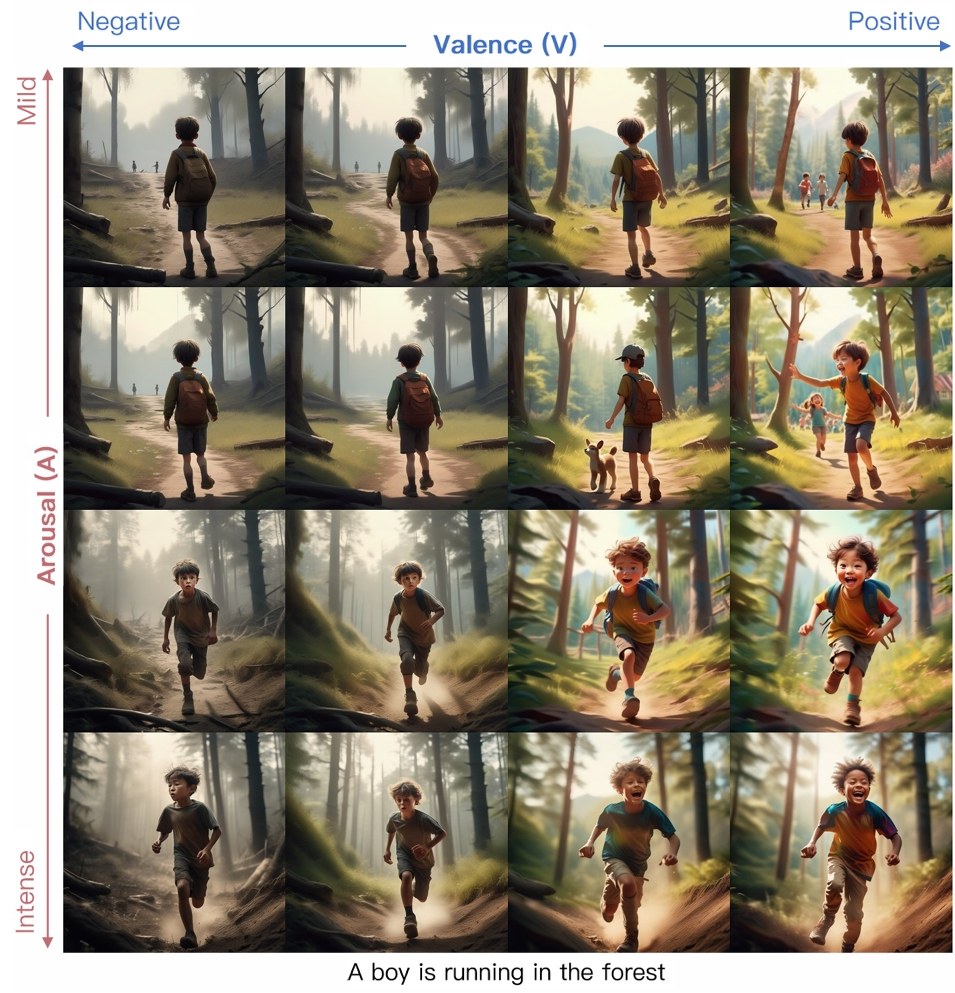
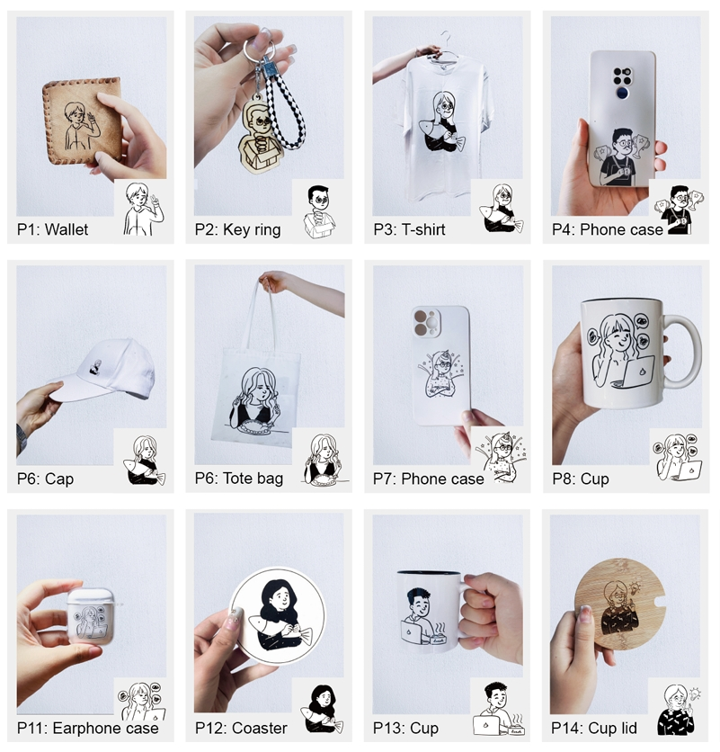

  🦋 Shengqi &ensp;&ensp;
  

    <nav>
      <ul style="list-style-type: none; margin: 0; padding: 0; display: flex; gap: 25px;">
        <li><a href="#/README.md#about" style="text-decoration: none; color: #343a40; font-weight: bold; font-size: 23px;">About</a></li>
        <li><a href="#/README.md#pub" style="text-decoration: none; color: #343a40; font-weight: bold; font-size: 23px;">Publications</a></li>
        <li><a href="#/README.md#project" style="text-decoration: none; color: #343a40; font-weight: bold; font-size: 23px;">Projects</a></li>
        <li><a href="#/README.md#internship" style="text-decoration: none; color: #343a40; font-weight: bold; font-size: 23px;">Internship</a></li>
      </ul>
    </nav>
  

<!-- 
Shengqi Dang 党圣奇
 -->
<!-- 
 &ensp;&ensp;&ensp;&ensp;&ensp;&ensp;&ensp;&ensp;&ensp;&ensp;&ensp;&ensp;  党圣奇

<!--  

🦋 Shengqi Dang &ensp;&ensp;&ensp;&ensp;&ensp;
<!-- 
Shengqi Dang 党圣奇
 -->
 
 
 
 
 
 
  
 👋 Hello, here is Shengqi. 🈠🕠💠😠🦙

 
 
 
 
 
 
 
 

dangsq123@163.com;  &ensp;&ensp;          dangsq123@tongji.edu.cn 

我是党圣奇（Shengqi Dang），是同济大学上海自主智能无人系统科学中心的在读博士生（专业：智能科学与技术，导师：曹楠），同时，我即将在2025年9月进入上海创智学院进行培养。我本科毕业于同济大学数学科学学院，获得了数学与应用数学学士学位。硕士就读于同济大学设计创意学院的人工智能与数据设计专业，并通过硕转博进入博士阶段的学习。 
我自诩具有复合学科背景，并对多学科交叉研究具有浓厚兴趣。我对计算机图形学，智能计算设计，心理学以及人工智能领域具有着浓厚的兴趣。我喜欢进行有创造力的活动，并期待在未来的研究中能够将这些兴趣转化为实际的创造性成果。如果你对我的研究有兴趣，欢迎与我联系。

 

I am Shengqi Dang, a Ph.D. candidate at the Shanghai Research Institute for Intelligent Autonomous Systems, Tongji University (major: Intelligent Science and Technology, advisor: Prof. Nan Cao). Additionally, I will join the Shanghai Innovation Institute for further training starting September 2025. I obtained my Bachelor's degree in Mathematics and Applied Mathematics from the School of Mathematical Sciences at Tongji University. I pursued my Master's degree in AI and Data Design at the College of Design and Innovation, Tongji University, and later transferred to the Ph.D. program.
I consider myself to have an interdisciplinary background and have a strong interest in cross-disciplinary research. My research interests include computer graphics, intelligent computational design, psychology, and artificial intelligence. I enjoy engaging in creative activities and look forward to translating these interests into practical and innovative outcomes in my future research. If you are interested in my research, please feel free to contact me.

 
 
 

<!-- 导航菜单 -->

Publications

  

    <!--  -->
  

  

    EmotiCrafter: Text-to-Emotional-Image Generation based on Valence-Arousal Model
      
    International Conference on Computer Vision (ICCV), 2025 (accepted)    
    Shengqi Dang*, Yi He*, Long Ling, Ziqing Qian, Nanxuan Zhao, Nan Cao     
  

  

    <!--  -->
  

  

     Supporting Product Personalization through Stylized Head Portraits
      
    Conference on Human Factors in Computing Systems (CHI), 2024    
    Yang Shi, Yechun Peng, Shengqi Dang, Nanxuan Zhao, Nan Cao     
  

  

    <!--  -->
  

  

    Bring Clipart to Life
      
   International Conference on Computer Vision (ICCV), 2023    
    Nanxuan Zhao, Shengqi Dang, Hexun Lin, Yang Shi, Nan Cao     
  

 
 
 

Projects

  

    <!--  -->
  

  

    智能音乐视频生成
      
    生成节奏对齐，语义清晰的音乐视频   
    <!-- Nanxuan Zhao, Shengqi Dang, Hexun Lin, Yang Shi, Nan Cao      -->
  

 

  

    <!--  -->
  

  

    科技树造型设计
      
   通过可视化分析历史发展规律，辅助设计人类科技树    
  

Internship

  

    <!--  -->
  

  

    科大讯飞 (IFLYTEK)
      
     助理算法工程师    
  

  

    <!--  -->
  

  

    小红书 (REDBOOK)
      
    商业算法实习生    
  

