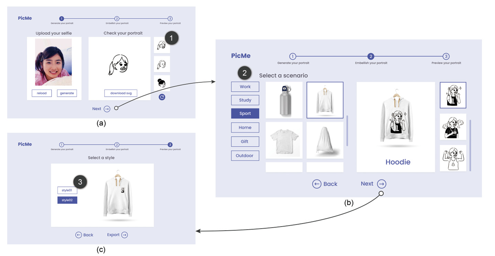
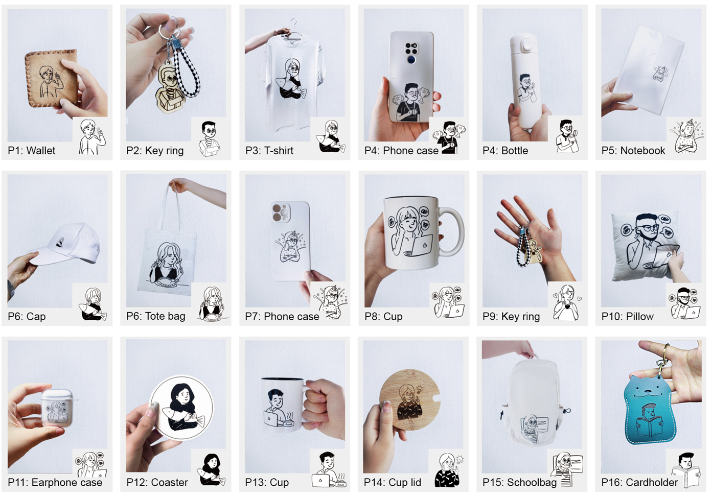

<!-- Project 1 -->

  

    

      <h3 class="project-title">
        LLM长短期记忆存储及任务规划  
        Research on LLM Long Short Term Memory Storage and Task Planning
      </h3>
      
李雪琛，刘雨绮，党圣奇 | 2023 fall Xuechen Li, Yuqi Liu, Shengqi Dang | 2023 fall

    

  

 
  

  
交互设计 · 智能体 · 大语言模型 · 用户界面设计 
Interaction Design · Agents · Large Language Models · User Interface Design
      
    大语言模型的出现让人们看到了解决复杂问题的可能。然而，受限于其自身的限制（幻觉,记忆有限，以及交互方式单一等问题），其在实际应用中往往会遇到一些挑战。 
    我们通过设计交互方式，让人类可以参与到大语言模型的记忆管理，并使用工作流的方式对模型的记忆进行整理和规划，从而实现更高效的记忆管理和任务规划。
      
    The emergence of large language models has shown the potential to solve complex problems. However, due to their inherent limitations (such as hallucinations, limited memory, and single interaction methods), they often face challenges in practical applications.
    We designed interaction methods that allow humans to participate in the memory management of large language models, using workflow approaches to organize and plan the model's memory, thereby achieving more efficient memory management and task planning.
  

  <button class="project-toggle" aria-expanded="false" aria-controls="proj-llm-details"> About More / 详情 </button>

  

    

      

        
        
        
        
        
        
        
      

    

  

<!-- Project 2 -->

  

    

      <h3 class="project-title">
        文字洪流  
        TORRENT OF WORDS
      </h3>
      
倪豪，何一，党圣奇 | 2023 winter Hao Ni, Yi He, Shengqi Dang | 2023 winter

    

  

 
  

    体验设计 · 视觉艺术 · 粒子模拟 / 流体模拟 · Unity
     
    Experience Design · Visual Art · Particle Simulation / Fluid Simulation · Unity
      
    生成式 AI 的时代，语言与文字已不再是人类的特权。如同新摩尔定律所述的那样，大语言模型所产生的文字和其中蕴含的情感、观点、知识、智慧正不断膨胀，终有一天会超过全体人类所产生的文字量。
    从第一次使用 GPT，惊喜之余担心被取代的错愕，到未来的某一天，大模型能替代某人说出一句让自己铭记一生的话。我们逐渐意识到，我们需要重新审视和自己和文字之间的连接。
    在这个作品中，我们希望通过一个多端的可交互程序，使观众在文字的洪流沉浸体验，寻找人和语言之间的新关系。
      
    In the era of generative AI, language and text are no longer exclusive to humans. As described by the new Moore's Law, the text generated by large language models, along with the emotions, opinions, knowledge, and wisdom they contain, is continuously expanding and will one day exceed the total amount of text produced by all humans.
    From the initial surprise and fear of being replaced when first using GPT, to a future day when large models can replace someone in saying words that will be remembered for a lifetime, we gradually realize that we need to re-examine our connection with text.
    In this work, we aim to create a multi-platform interactive program that allows audiences to immerse themselves in the torrent of words and explore new relationships between humans and language.
  

  <button class="project-toggle" aria-expanded="false" aria-controls="proj-tt-details"> About More / 详情 </button>

  

    <video controls style="width:100%; height:auto; display:block;" poster="./figs/Slide 16_9 - 1.jpg">
      <source src="./figs/zzzzzzzz.mp4" type="video/mp4">
      您的浏览器不支持 video 标签。
    </video>
  

<!-- Project 3 -->

  

    

      <h3 class="project-title">radical run run run</h3>
      
倪豪，叶婧鑫，党圣奇 | 2024 spring & summer Hao Ni, Jingxin Ye, Shengqi Dang | 2024 spring & summer

    

  

 
  

    游戏设计 · 算法设计 · 传统文化
     
    Game Design · Algorithm Design · Traditional Culture
      
    许多外国人发现学习中文是一项具有挑战性的任务，尤其是汉字。即使是一些中国人，由于长时间使用电脑打字，也会发现在写字时偶尔忘记某个汉字的写法。我们的游戏旨在为用户提供一个轻松、愉快的学习途径，用户利用碎片时间来玩游戏，他们既可以打发时间，也可以提高的汉字识别和书写能力。
      
    Many foreigners find learning Chinese to be a challenging task, especially Chinese characters. Even some Chinese people, due to prolonged use of computer typing, occasionally forget how to write certain characters. Our game aims to provide users with a relaxed and enjoyable learning approach, allowing them to use fragmented time to play the game, where they can both pass the time and improve their Chinese character recognition and writing skills.
  

  <button class="project-toggle" aria-expanded="false" aria-controls="proj-rr-details"> About More / 详情 </button>

  

    
  

<!-- Project 4: stable diffusion（已整理样式） -->

  

    

      <h3 class="project-title">stable diffusion 如何想象图像 -- 一段数据可视化之旅 How Stable Diffusion Imagines Images - A Data Visualization Journey</h3>
      
倪豪，党圣奇 | 2023 fall Hao Ni, Shengqi Dang | 2023 fall

    

  

 
  

    信息设计 · 可视化 · 前端 · 生成式模型
     
    Information Design · Visualization · Frontend · Generative Models
      
    移步到 sd-vis.ioclab.app 概览内容（以下网页嵌入可能会出现自适应问题）。
      
    Visit sd-vis.ioclab.app to view the content (the embedded webpage below may have adaptive issues).
  

  <button class="project-toggle" aria-expanded="false" aria-controls="proj-sd-details"> About More / 详情 </button>

  

    

      <iframe
        src="https://sd-vis.ioclab.app/"
        style="width:100%; height:100%; border:none;"
        allowfullscreen
        loading="lazy"></iframe>
    

  

<!-- Project 5: Picme（已整理样式） -->

  

    

      <h3 class="project-title">Picme 个性化内容定制系统 Picme Personalized Content Customization System</h3>
      
彭也纯，党圣奇，石洋，曹楠，赵南轩 | 2022 fall Yechun Peng, Shengqi Dang, Yang Shi, Nan Cao, Nanxuan Zhao | 2022 fall

    

  

 
  

    交互设计 · 内容定制 · 卡通头像生成
     
    Interaction Design · Content Customization · Cartoon Avatar Generation
      
    个性化产品帮助我们提升自我认识以及有助于自我表达，基于此，我们利用深度学习模型设计了头像照片到卡通头像的转化系统，并应用到个性化内容定制系统中。
      
    Personalized products help us enhance self-awareness and facilitate self-expression. Based on this, we designed a system using deep learning models to transform profile photos into cartoon avatars and applied it to a personalized content customization system.
  

  <button class="project-toggle" aria-expanded="false" aria-controls="proj-picme-details"> About More / 详情 </button>

  

    

      
      
    

  

  © 2025 Shengqi Dang. All rights reserved. 
  版权所有 © 2025 党圣奇

