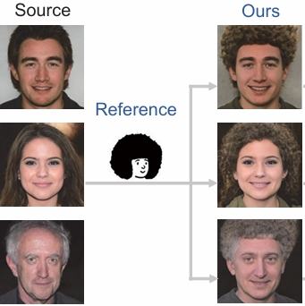

Projects&Internship

  

    <!--  -->
  

  

    智能音乐视频生成
      
    生成节奏对齐，语义清晰的音乐视频   
    <!-- Nanxuan Zhao, Shengqi Dang, Hexun Lin, Yang Shi, Nan Cao      -->
  

 

  

    <!--  -->
  

  

    科技树造型设计
      
   通过可视化分析历史发展规律，辅助设计人类科技树    
  

  

    <!--  -->
  

  

    科大讯飞 (IFLYTEK)
      
     助理算法工程师    
  

  

    <!--  -->
  

  

    小红书 (REDBOOK)
      
    商业算法实习生    
  

