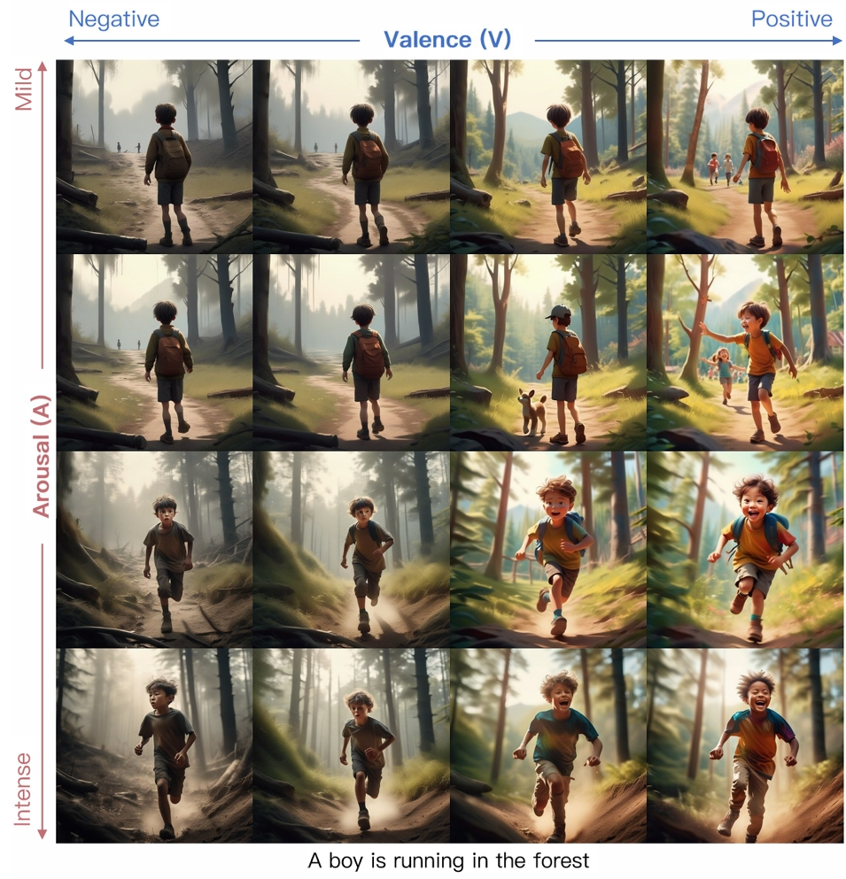
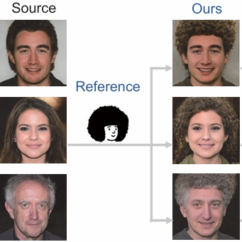

Publications
      

  <!-- 
 -->
    <!--  -->
  <!-- 
 -->
  

    EmotiCrafter: Text-to-Emotional-Image Generation based on Valence-Arousal Model
      
    International Conference on Computer Vision (ICCV), 2025 (accepted)    
    Shengqi Dang*, Yi He*, Long Ling, Ziqing Qian, Nanxuan Zhao, Nan Cao     
    <!-- 智能可控的情感化图像生成  -->
    <!-- Controllable Emotional Image Generation -->
  

  <!-- 
 -->
    <!--  -->
  <!-- 
 -->
  

    <a href="https://dl.acm.org/doi/abs/10.1145/3613904.3642391"> Supporting Product Personalization through Stylized Head Portraits</a>
      
    Conference on Human Factors in Computing Systems (CHI), 2024    
    Yang Shi, Yechun Peng, Shengqi Dang, Nanxuan Zhao, Nan Cao     
    <!-- 个性化头像生成算法与物品个性化系统  -->
    <!-- Personalized Avatar Generation and Product Personalization System -->
    <!--    -->
  

  <!-- 
 -->
    <!--  -->
  <!-- 
 -->
  

    <a href="https://openaccess.thecvf.com/content/ICCV2023/html/Zhao_Bring_Clipart_to_Life_ICCV_2023_paper.html">Bring Clipart to Life</a>
      
    International Conference on Computer Vision (ICCV), 2023    
    Nanxuan Zhao, Shengqi Dang, Hexun Lin, Yang Shi, Nan Cao     
    <!-- 基于拼贴画交互的照片编辑算法  -->
    <!-- Photo Editing Algorithm Based on Clipart Interaction -->
    <!--     -->
  

