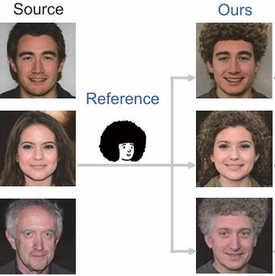
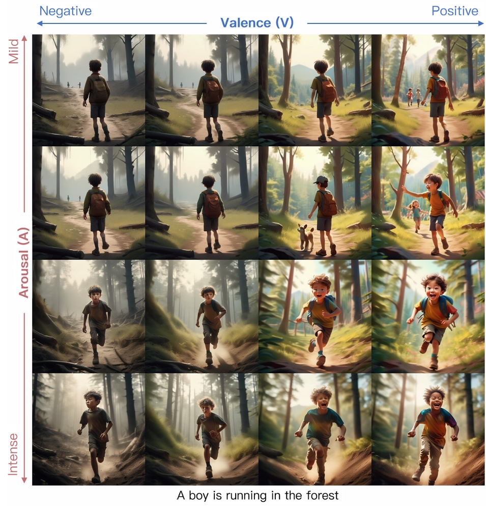

Service
  
Reviewer: AAAI2026, CVPR2026
   
Publications
   
Conference
      

  

    <a href = "./">DensiCrafter: Physically-Constrained Generation and Fabrication of Self-Supporting Hollow Structures</a>
          
        

      3D生成
      物理条件嵌入
      可打印物体生成
    

          
    
    Annual AAAI Conference on Artificial Intelligence (AAAI), 2026 (Accepted)    
    Shengqi Dang, Fu Chai, Jiaxin Li, Chao Yuan, Wei Ye, Nan Cao     
  

  

    <a href = "./">Designed to Spread: Generative Approaches to Enhance Information Diffusion</a>
          
        

      动态信息设计
      信息传播
      互联网营销
    

          
    
    Annual AAAI Conference on Artificial Intelligence (AAAI), 2026 (Accepted)    
    Ziqing Qian, Jiaying Lei, Shengqi Dang, Nan Cao     
  

  

    <a href = "https://openaccess.thecvf.com/content/ICCV2025/html/Dang_EmotiCrafter_Text-to-Emotional-Image_Generation_based_on_Valence-Arousal_Model_ICCV_2025_paper.html">EmotiCrafter: Text-to-Emotional-Image Generation based on Valence-Arousal Model</a>
          
        

      情感图像生成
      图像生成模型
      情感计算
    

          
    
    International Conference on Computer Vision (ICCV), 2025    
    Shengqi Dang, Yi He, Long Ling, Ziqing Qian, Nanxuan Zhao, Nan Cao     
    <!-- 智能可控的情感化图像生成  -->
    <!-- Controllable Emotional Image Generation -->
  

  

    <a href="https://dl.acm.org/doi/abs/10.1145/3613904.3642391"> Supporting Product Personalization through Stylized Head Portraits</a>
          
      

      个性化产品
      卡通头像生成
    

          
    Conference on Human Factors in Computing Systems (CHI), 2024    
    Yang Shi, Yechun Peng, Shengqi Dang, Nanxuan Zhao, Nan Cao     
    <!-- 个性化头像生成算法与物品个性化系统  -->
    <!-- Personalized Avatar Generation and Product Personalization System -->
    <!--    -->
  

  <!-- 
 -->
    <!--  -->
  <!-- 
 -->
  

    <a href="https://openaccess.thecvf.com/content/ICCV2023/html/Zhao_Bring_Clipart_to_Life_ICCV_2023_paper.html">Bring Clipart to Life</a>
          
      照片编辑
      StyleGAN图像生成
      交互方式设计
     
     
         
    International Conference on Computer Vision (ICCV), 2023    
    Nanxuan Zhao, Shengqi Dang, Hexun Lin, Yang Shi, Nan Cao     
    <!-- 基于拼贴画交互的照片编辑算法  -->
    <!-- Photo Editing Algorithm Based on Clipart Interaction -->
    <!--     -->
  

 

Journals

  <!-- 
 -->
    <!--  -->
  <!-- 
 -->
  

    <a href = "https://dl.acm.org/doi/10.1145/3748515"> MV-Crafter: An Intelligent System for Music-guided Video Generation</a>
      
          音乐视频生成
          智能体
      
    ACM Transactions on Interactive Intelligent Systems, 2025     
    Chuer Chen, Shengqi Dang, Yuqi Liu, Nanxuan Zhao, Yang Shi, Nan Cao     
    <!-- 智能可控的情感化图像生成  -->
    <!-- Controllable Emotional Image Generation -->
  

  © 2025 Shengqi Dang. All rights reserved. 
  版权所有 © 2025 党圣奇

