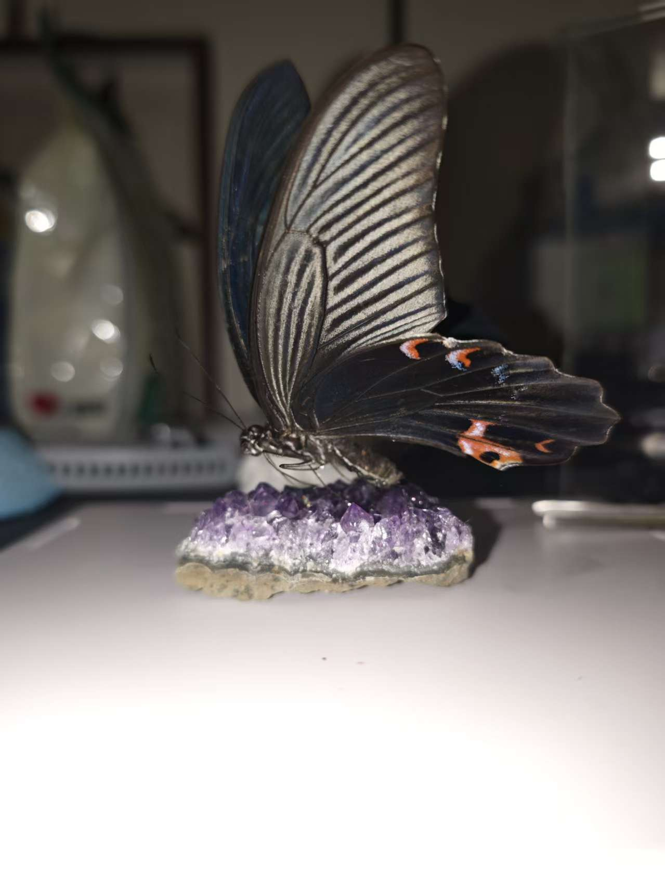
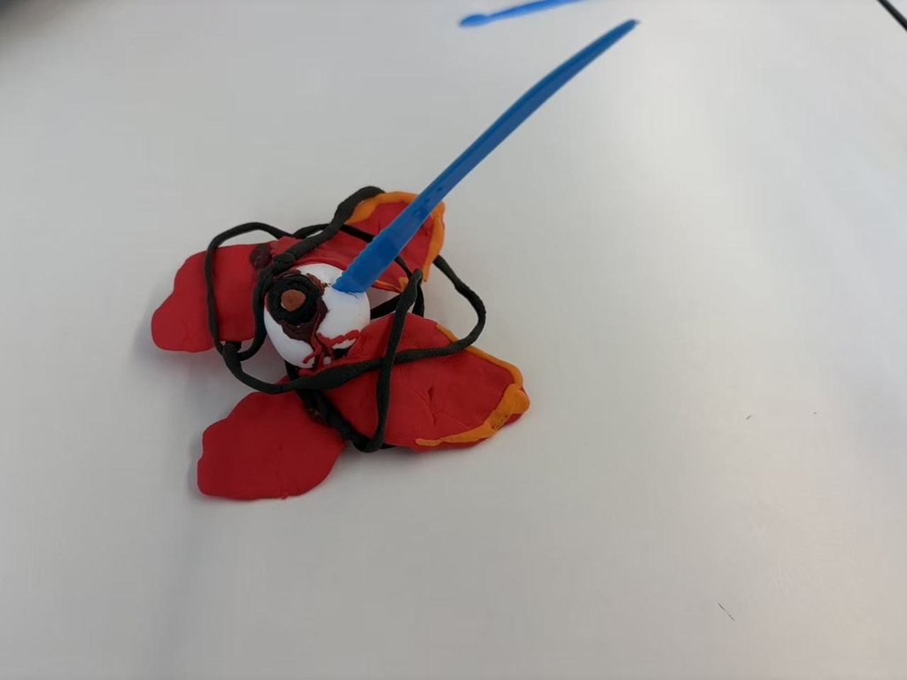
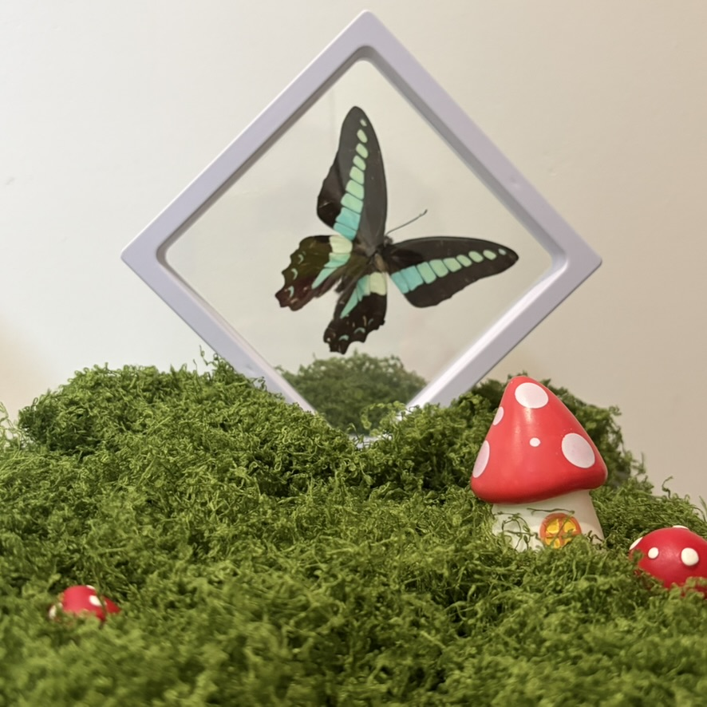
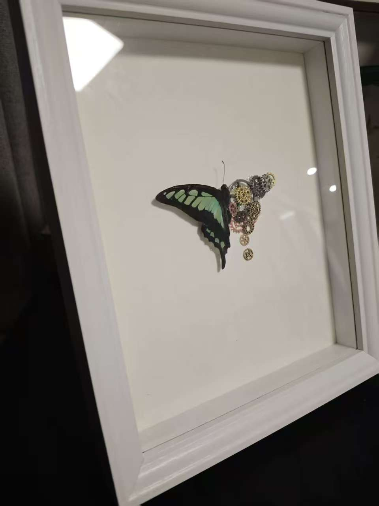
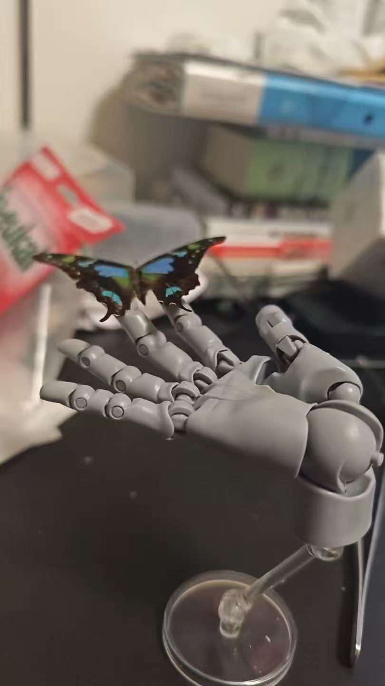

  

    <button class="gallery-nav-button prev" onclick="window.galleryPrev()">&#8249;</button>
    
    <button class="gallery-nav-button next" onclick="window.galleryNext()">&#8250;</button>
    
立姿展翅1

  

  
  

    

      
      
      
      
      
    

  

  © 2025 Shengqi Dang. All rights reserved. 
  版权所有 © 2025 党圣奇

